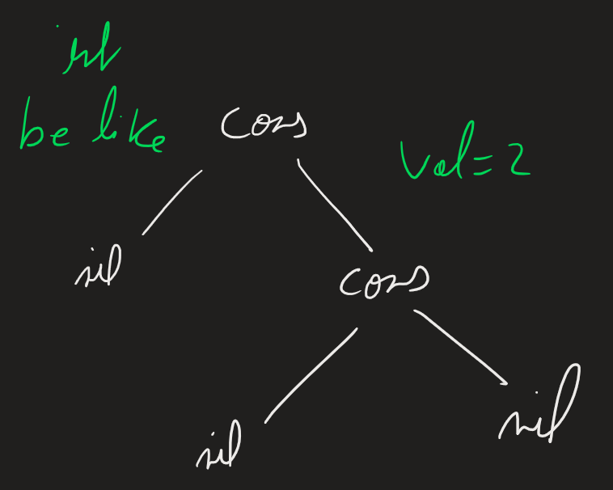
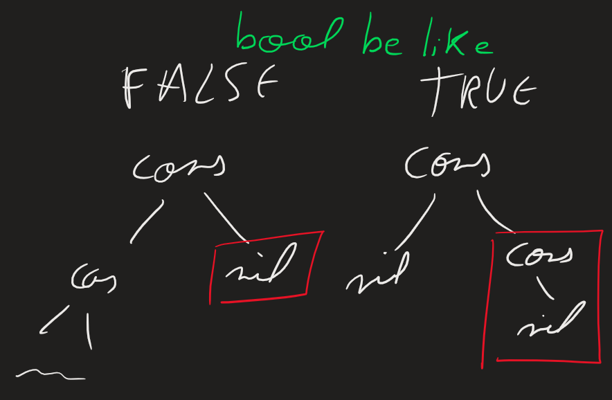
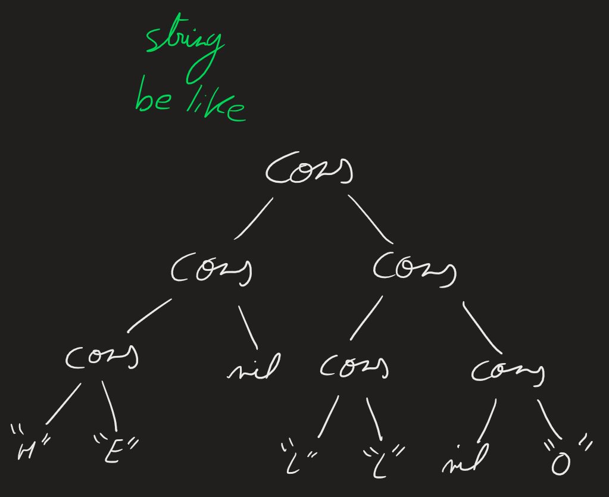
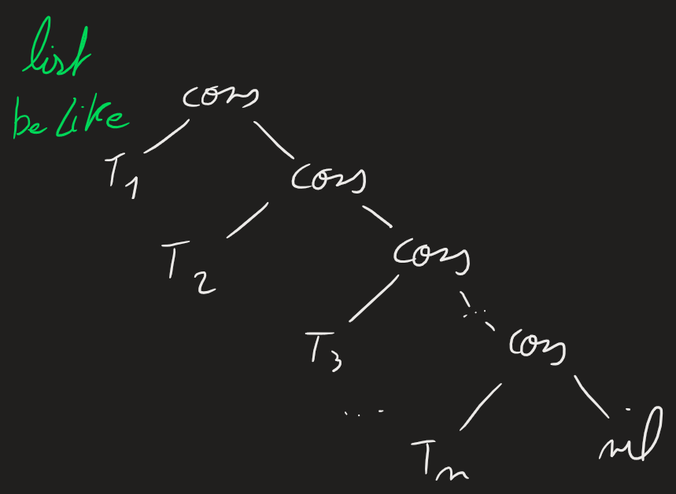

# Project_TLC
Project in team of 4 members during our studies at the engineering school of ESIR

# I. Introduction

Pour ce projet, nous allons essayer de fabriquer un compilateur du langage "While" décrit dans le sujet. Ce langage est un langage de programmation fonctionnel, il est donc composé de fonctions et de variables. Il est également possible de faire des boucles et des conditions. 

# II. Etude du langage While

Afin de pouvoir nous concentrer sur la partie compilation, nous allons analyser plus en détail le langage "While".

## 1. les types de données

Tout les types de données du langage While sont représentés par des arbres binaires.

### 1.1. Les entiers

Nous allons commencer par voir comment sont représentés les entiers dans le langage While. Les entiers représentent ici uniquement des nombres entiers positifs. La valeur d'un entier correspond au nombre de noeuds sur la branche droite de l'arbre.

### 1.2. Les booléens

Les booléens sont représentés par des arbres binaires. La valeur d'un booléen vaut 0 (False) si l'arbre est vide et 1 (True) si l'arbre contient des noeuds sur la branche droite.

### 1.3. Les chaînes de caractères

Les chaînes de caractères sont représentées par des arbres binaires. La valeur d'une chaîne de caractères est la concaténation des caractères présentes dans l'arbre binaire de gauche à droite.

### 1.4. Les listes

Les listes sont représentées par des arbres binaires. Une liste contient des éléments de même type. Les valeurs de la liste sont les valeurs des fils gauche de l'arbre.

## 2. Les commandes et structures de contrôle

- nop
- point virgule
- if then fi
- if then else fi
- while
- for
- foreach
- assignation de variable
- évalution de fonction

https://theantlrguy.atlassian.net/wiki/spaces/ANTLR3/pages/2687087/Interfacing+AST+with+Java