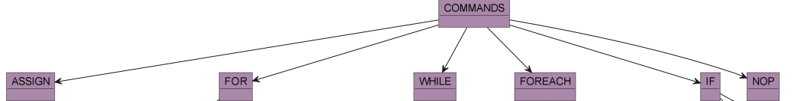
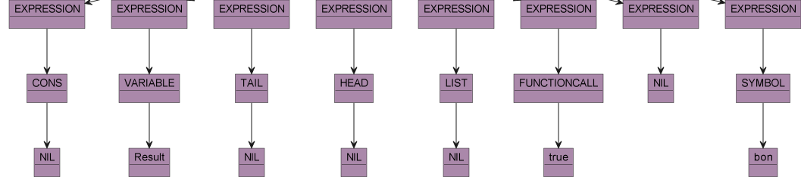

## Description de l'AST :

Dans cette section nous allons décrire l'AST, c'est-à-dire la représentation formelle de notre langage par des tokens.

###Structure du programme

Tout d'abord, un programme est représenté par une racine ayant pour fils des fonctions :

Une fonction a tout d'abord un nom, puis un token définition de fonction. Celui-ci a optionnellement une entrée, des commandes, c'est-à-dire le corps de la fonction et obligatoirement une sortie :

L'entrée et la sortie correspondent directement à des variables comme on peut le voir :

###Commandes

Les commandes, soit les instructions du corps de la fonction peuvent correspondre à des instructions comme des boucles ou des conditions, à des déclarations/modifications de variables ou l'instruction vide 'nop'. Il faut au moins une commande :

L'affectation de variables peut être effectuée sur plusieurs variables à partir d'expressions :

Les conditionnelles peuvent sont composées d'une expression à vérifier, de commandes et d'éventuelles commandes à effectuer en cas de non-respect de la première expression :

Pour les boucles 'for' et 'while', la structure est la même :

for:

while:

Les boucles 'foreach' prennent elles en entrée une variable qui est la structure à parcourir :

Enfin, l'instruction 'nop' correspond juste au token 'NOP'.

###Expressions 

Les expressions sont tout d'abord représentées par une suite d'expressions :

Une expression peut correspondre à une variable, une liste, une queue, un tas, un appel de fonction, une valeur, un symbole ou la valeur 'nil' :

Comme on peut le voir, les symboles et variables sont décrits directement par un nom de variable.
Les structures comme les listes, les queues, les tas et l'appel de fonctions contiennent d'autres expressions dans la hiérarchie correspondant à leurs données :

Par exemple pour les listes : 

On peut remarquer que l'on peut imbriquer n'importe quelle expression comme un appel de fonction ou une autre liste dedans.
