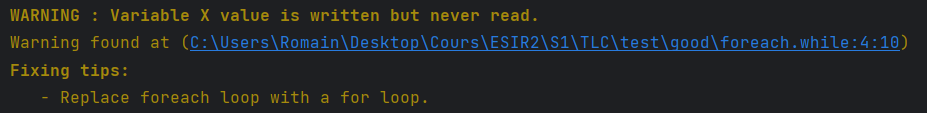
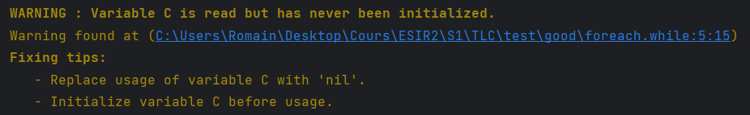

## Validation du langage :

La validation est une étape cruciale dans le processus de compilation de notre compilateur.
Pour cela, nous avons conçu un objet PreCompileValidator qui permet d'attacher un ou plusieurs modules de validation, appelés Validator. 
Chacun de ces Validator a un rôle précis de validation, comme vérifier la syntaxe du code, les erreurs de typage, etc.

L'intérêt de concevoir notre système de validation sous forme de modules s'attachant comme on le souhaite est la flexibilité qu'il offre.
Cela permet de facilement ajouter ou retirer des Validator au fil du temps, sans avoir à refaire toute la validation.

Nous sommes conscients que cette flexibilité peut ralentir le processus de validation. 
En effet, chaque Validator a besoin de parcourir l'AST pour effectuer sa validation spécifique, ce qui entraîne plusieurs visites de l'AST. 
Cela signifie que pour chaque Validator attaché à l'objet PreCompileValidator, l'AST doit être parcouru une fois supplémentaire, ce qui peut entraîner un temps d'exécution plus long.

Il s'agit d'un choix que nous avons fait de sacrifier un peu de temps pour la validation pour obtenir une plus grande flexibilité dans les vérifications effectuées et pour pouvoir facilement ajouter ou retirer des vérifications.

Voici la liste des erreurs de validation que nous avons implémentée :

| Command/Lexème concerné | Prérequis                                                                                                 | Message d'erreur                                                                                    |
|-------------------------|-----------------------------------------------------------------------------------------------------------|-----------------------------------------------------------------------------------------------------|
| `foreach`               | `foreach` doit prendre en paramètre une expression qui peut être assimilé à une liste                     | Expected list expression. Got function call with multiple return values.                            |
| `while`                 | `while` doit prendre en paramètre une expression qui peut être assimilé à un booléen                      | Expected boolean expression. Got function call with multiple return values.                         |
| `if`                    | `if` doit prendre en paramètre une expression qui peut être assimilé à un booléen                         | Expected boolean expression. Got function call with multiple return values.                         |
| `for`                   | `for` doit prendre en paramètre une expression qui peut être assimilé à un entier                         | Expected integer expression. Got function call with multiple return values.                         |
| `assign :=`             | le nombre de variables à assignées doit être égal aux nombres de valeurs retourné par l'appel de fonction | The number of variable(s) is not equals to the number of value(s) that the function called returns. |
| `assign :=`             | le nombre de variables à assignées doit être égal au nombre d'expression assigné                          | The number of variable(s) is not equals to the number of value(s) that the expression returns.      |
| `variable`              | les variables en entrée de fonction ne doivent pas avoir le même nom                                      | Duplicate variable argument name {$VARNAME}.                                                        |
| `variable`              | les variables en sortie de fonction ne doivent pas avoir le même nom                                      | Duplicate variable output name {$VARNAME}.                                                          |
| `function`              | les fonctions doivent avoir des noms différents                                                           |                                                                                                     |
| `function`              | un appel de fonction doit appelé une fonction qui est défini dans le programme                            |                                                                                                     |
| `function`              | un appel de fonction doit avoir le bon nombre d'arguments                                                 |                                                                                                     |
| `program`               | un programme doit contenir une fonction nommée "main"                                                     |                                                                                                     |

Nous avons également choisi d'implémenter des avertissements, appelés "Warnings". 
Les avertissements ne font pas quitter la compilation s'il y en a, mais ils indiquent des mauvaises pratiques de code ou des erreurs potentielles qui pourraient causer des problèmes à l'avenir.

Voici la liste des avertissements que nous avons implémenté :

| Command/Lexème concerné | Prérequis                                                                                                        | Message d'avertissement                                                       |
|-------------------------|------------------------------------------------------------------------------------------------------------------|-------------------------------------------------------------------------------|
| `variable`              | une variable en entrée d'une fonction doit être utilisé dans la fonction sinon elle n'a pas d'utilité            | Input variable {$VARNAME} is never read.                                      |
| `variable`              | une variable en sortie d'une fonction doit être assignée dans la fonction                                        | No value is assign to output variable {$VARNAME} in the function {$FUNCNAME}. |
| `variable`              | une valeur est assigné à une variable qui ne sera jamais lu ensuite                                              | Variable {$VARNAME} value is written but never read.                          |
| `variable`              | la valeur d'une variable non initialisée est lue                                                                 | Variable {$VARNAME} is read but has never been initialized.                   |
| `variable`              | une valeur est assigné à une variable(initialisée) avant que la précédente valeur de cette variable n'ait été lu | Input variable {$VARNAME} is written before it is read.                       |

Notre système de validation comporte des fonctionnalités pratiques qui aident les développeurs à identifier et à corriger les erreurs ou les mauvaises pratiques de code efficacement.

Tout d'abord, chaque erreur ou avertissement est accompagné d'un lien vers la ligne et le caractère où se trouve l'erreur. 
Cela permet aux développeurs de rapidement identifier l'emplacement de l'erreur dans leur code. 
Il est même possible de cliquer sur ce lien pour ouvrir directement le fichier dans l'éditeur de code, avec le curseur positionné sur l'erreur. 
Cela facilite encore plus l'identification et la correction de l'erreur.

Ensuite, certains avertissements ou erreurs sont accompagnés d'astuces ou de suggestions pour résoudre le problème. 
Ces astuces et suggestions peuvent aider les développeurs à corriger rapidement les erreurs sans avoir à perdre du temps à rechercher la solution eux-mêmes.

