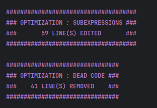

# Introduction 

L'optimisation du code à 3 adresses a pour but de rendre le code plus efficace et plus performant avant qu'il ne soit compilé en code cible. Il existe de nombreuses techniques d'optimisation qui peuvent être utilisées pour améliorer les performances du code, telles que :

- **La suppression de code mort** : consiste à supprimer du code qui ne sert à rien (par exemple, des instructions qui ne changent pas les variables)
- **La propagation de constantes** : consiste à remplacer des variables par leurs valeurs constantes lorsque cela est possible
- **La fusion d'instructions** : consiste à regrouper plusieurs instructions en une seule pour réduire le nombre d'instructions exécutées.

Toutes ces techniques d'optimisation visent à réduire le nombre d'instructions exécutées et à améliorer la performance globale du code. L'optimisation du code à 3 adresses permet d'améliorer les performances du code avant qu'il ne soit compilé en code cible, ce qui permet d'obtenir un code cible plus performant.

L'optimisation du code intermédiaire de notre compilateur est gérée par l'objet GlobalOptimizer, qui permet d'attacher des objets de la classe Optimizer pour effectuer différentes tâches d'optimisation. Ce design modulaire permet d'ajouter ou de supprimer des optimisations facilement sans impacter le reste du code.

Afin de maximiser l'efficacité de l'optimisation, nous avons désigné la structure des optimiseurs locaux dans la classe LocalOptimizer. Cette classe prend en charge le parcours du code 3 adresses en séparant les blocs de base et en découpant les instructions avec les goto et les labels.

Parmi les optimiseurs locaux, nous avons créé le SubExpressionsOptimizer qui hérite de LocalOptimizer. Il est chargé de remplacer toutes les sous-expressions communes par des variables et également de propager les copies des variables. Cela permet de réduire la complexité du code et d'accélérer les calculs en réutilisant les résultats de calculs précédents.

Enfin, nous avons la classe DeadCodeOptimizer qui est efficace une fois que SubExpressionsOptimizer a fait son travail. Cette classe va supprimer tous les assignements de variables qui sont devenus inutiles car les variables ne sont plus utilisées. Cela permet de réduire la taille du code et d'améliorer les performances.

En somme, l'optimisation du code intermédiaire de notre compilateur utilise une approche modulaire pour cibler les optimisations sur les parties du code qui en ont le plus besoin. En utilisant des optimiseurs locaux tels que SubExpressionsOptimizer et DeadCodeOptimizer, nous avons réussi à réduire la complexité du code et à améliorer les performances de notre compilateur.

Exemple d'affichage de l'optimisation (option verbose ON) sur le sample integers.while :

Cependant, pour aller plus loin dans l'optimisation, il aurait été intéressant de développer davantage la suppression de code mort. En effet, notre approche actuelle se limite à l'identification des variables vivantes, il aurait été bénéfique d'étendre cette suppression en identifiant des blocs de base qui ne sont jamais atteints par exemple. Cela aurait permis de supprimer encore plus de code inutile.

En outre, il aurait été intéressant d'ajouter d'autres optimisations dont des globales.